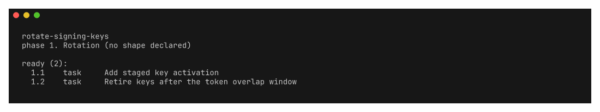

# specutil




`specutil` reads local OpenSpec changes and projects them into review artifacts.
It performs no network I/O.

The repository must contain `openspec/changes/`. Optional settings live in
`openspec/specutil.yaml` and `openspec/config.yaml`.

## Install

### Homebrew

```bash
brew install roshbhatia/tap/specutil
```

### Nix

```bash
nix run github:roshbhatia/specutil -- --help
```

Add it to a flake with `github:roshbhatia/specutil`. The default package omits
optional integrations. Use the `full` package to include every provider extra.

### Release archive

Tagged releases publish archives for macOS and Linux on ARM64 and x86-64. Each
archive contains the binary and completions for Bash, Zsh, Fish, and Nushell.

## Configuration

Keep repository settings in `openspec/specutil.yaml`. `specutil generate`
is reserved for regenerating this source repository. Export the consumer schema
from any directory without modifying it:

```bash
specutil config schema > openspec/specutil.schema.json
```

Nix installs the same schema at `share/specutil/schema/specutil.schema.json` and
exports it as `lib.schemas.project`. Specutil does not read a user-global
settings file.

```yaml
# yaml-language-server: $schema=specutil.schema.json
changes:
  rotate-signing-keys:
    depends_on: [add-key-versioning]
```

## Optional integrations

The core package has no agent dependency. The `full` Nix package includes the
`command` suggestion provider. It sends the prompt to an executable on standard
input. Use a small wrapper when a command needs a prompt flag.

```bash
nix run github:roshbhatia/specutil#full -- \
  graph --suggest --provider command --command my-agent
```

Provider manifests use the shared `provider/v1` contract. Override discovery
with `SPECUTIL_PROVIDERS_DIRECTORY`, or install manifests under
`$XDG_DATA_HOME/specutil/providers`.

## Examples

```bash
# Review the next executable work in a release migration.
specutil next rotate-signing-keys --as json | jq '.stages[]'

# Embed the current dependency graph in a design review.
specutil graph --as mermaid > docs/migration-graph.mmd

# Render an RFC and prove that it meets the repository rubric.
specutil render rotate-signing-keys --as rfc -o docs/key-rotation.md
specutil check rotate-signing-keys

# Inspect review drift without contacting any remote service.
specutil review diff rotate-signing-keys
```

## Commands
<!-- BEGIN GENERATED:cli -->

### `specutil`

Project OpenSpec change artifacts into other artifacts and visualizations

specutil parses spec-framework change artifacts (OpenSpec in v1) into a normalized IR and projects them into RFCs, design docs, tickets, dependency graphs, and visualizations. It performs no network I/O.

| Option | Description |
| --- | --- |
| `--repo`, `-C` `<value>` | repository root containing the openspec/ directory |

### `specutil check`

Validate changes against the rubric declared in specutil.yaml

Checks each change against a declared rubric and exits non-zero when any
rule is violated, so it works as a pre-commit hook or a CI gate.

Rules are generic and parameterized; the repository supplies the specifics
under `check:` in openspec/specutil.yaml. When that block is absent and
openspec/config.yaml names a schema specutil ships a preset for, that preset
applies automatically. A repository with neither is not checked.

Every rule reads only what the author stated: a heading that is present, a
marker that is declared, a bullet that follows another. None infers intent
from prose, so two runs over the same input always agree.

Exit codes:
  0  every rule passed (warnings may still be reported)
  1  at least one error-severity rule was violated

Typical invocations:
  specutil check                     # every change
  specutil check my-change           # one change
  specutil check --as json | jq      # machine-readable findings
  specutil check --list-rules        # what the resolved rubric enforces

| Option | Description |
| --- | --- |
| `--as` `<value>` | output format: text\|json |
| `--change` `<value>` | check a single change (or pass as positional arg) |
| `--list-rules` | list every built-in rule and exit |
| `--out`, `-o` `<value>` | write output to a file instead of stdout |
| `--repo`, `-C` `<value>` | repository root containing the openspec/ directory |

### `specutil config`

Inspect project configuration support

| Option | Description |
| --- | --- |
| `--repo`, `-C` `<value>` | repository root containing the openspec/ directory |

### `specutil config schema`

Print the project configuration JSON Schema

| Option | Description |
| --- | --- |
| `--repo`, `-C` `<value>` | repository root containing the openspec/ directory |

### `specutil generate`

Regenerate artifacts in the specutil source repository

| Option | Description |
| --- | --- |
| `--check` | fail when a generated artifact is stale |
| `--help`, `-h` | help for generate |
| `--repo`, `-C` `<value>` | repository root containing the openspec/ directory |

### `specutil graph`

Output the cross-change dependency graph in various formats

Projects the cross-change dependency DAG into a machine-readable format for
integration with external tools. Primarily used by the skills and CI scripts;
for interactive browsing use `specutil web` instead.

Output formats:
  json     — Full graph model (nodes + edges) as JSON [default]
  mermaid  — Mermaid graph definition for embedding in docs or GitHub
  dot      — Graphviz DOT format for rendering with graphviz tools
  detail   — Per-change ticket detail feed (same as DETAIL in web view)

The --suggest flag infers candidate edges from shared capabilities without
writing anything. Pair it with an installed suggestion provider for deeper
semantic analysis. The optional command provider can run any configured agent.

Typical invocations:
  specutil graph --as mermaid                      # insert into a doc or README
  specutil graph --suggest                         # discover implied edges
  specutil graph --suggest --provider command --command my-agent
  specutil graph --as json | jq                    # pipe to other tools

| Option | Description |
| --- | --- |
| `--as` `<value>` | output format: json\|mermaid\|dot\|detail |
| `--command` `<value>` | executable passed to the optional command provider |
| `--out`, `-o` `<value>` | write output to a file instead of stdout |
| `--provider` `<value>` | external suggestion provider (default: heuristic only) |
| `--suggest` | infer candidate edges from shared capabilities (read-only) |
| `--repo`, `-C` `<value>` | repository root containing the openspec/ directory |

### `specutil next`

Report which subtasks are runnable now

Answers one question: what runs now.

A tasks.md declares a shape, a dependency edge per subtask, and a stop
condition. Without a consumer those declarations are documentation, and the
work gets done top to bottom whatever the graph says. This reads them.

Readiness never crosses a phase, because a phase is a boundary between runs.
The reported phase is the lowest-numbered one still holding pending work; the
ready set is every pending subtask in it whose dependencies are complete.

A graph phase with more than one runnable subtask reports concurrent, so the
caller can fan out. A loop phase does not: its next iteration reads the state
the current one writes. Owner gates and adversarial reviews are never counted
as fan-out work.

Exit codes:
  0  a ready set was reported, or every task is complete
  2  work remains but nothing is runnable, which means a dependency cycle

Typical invocations:
  specutil next                      # the active change
  specutil next my-change            # one change
  specutil next --as json | jq       # drive a runner from the ready set

| Option | Description |
| --- | --- |
| `--as` `<value>` | output format: text\|json |
| `--change` `<value>` | report a single change (or pass as positional arg) |
| `--out`, `-o` `<value>` | write output to a file instead of stdout |
| `--repo`, `-C` `<value>` | repository root containing the openspec/ directory |

### `specutil provider`

Inspect optional suggestion providers

| Option | Description |
| --- | --- |
| `--repo`, `-C` `<value>` | repository root containing the openspec/ directory |

### `specutil provider list`

List discovered suggestion providers

| Option | Description |
| --- | --- |
| `--json` | emit provider metadata as JSON |
| `--repo`, `-C` `<value>` | repository root containing the openspec/ directory |

### `specutil provider validate`

Validate provider manifests and runtime commands

| Option | Description |
| --- | --- |
| `--json` | emit validation reports as JSON |
| `--repo`, `-C` `<value>` | repository root containing the openspec/ directory |

### `specutil render`

Render a change into a shareable document (rfc|design|tickets)

Projects an OpenSpec change into a human-readable document for sharing with
stakeholders. Three output formats are supported:

  rfc      — RFC-style proposal doc (Why, What Changes, Requirements)
  design   — Technical design doc (Context, Goals, Decisions, Rollout)
  tickets  — Flat task checklist suitable for copy-paste into a tracker

Output goes to stdout by default; use -o to write a file. Combine with
git hooks or CI to auto-generate docs on change commits, or run manually
when preparing a design review or sprint planning session.

Typical invocations:
  specutil render --as rfc --change my-change
  specutil render --as tickets -o tickets.md

| Option | Description |
| --- | --- |
| `--as` `<value>` | target format: rfc\|design\|tickets (required) |
| `--change` `<value>` | change name to render (or pass as positional arg) |
| `--out`, `-o` `<value>` | write output to a file instead of stdout |
| `--templates` `<value>` | override built-in template directory |
| `--repo`, `-C` `<value>` | repository root containing the openspec/ directory |

### `specutil review`

Record a human verdict on a change and report what moved since

Carries a reviewer's decision back to the agent that wrote the change.

  review show    — the standing verdict, open comments, and drift
  review diff    — the working-tree diff since the review, hunk by hunk
  review ingest  — fold an annotation export from `specutil web` into the record
  review set     — record a decision directly, without the browser

The record lives at openspec/changes/<name>/specutil.review.yaml and
fingerprints the artifacts it describes. When the artifacts change, the
decision is reported as stale rather than silently continuing to apply, and
each task is classified as new, changed, or unchanged against what was read.

Staleness is decided by content hash, never by a timestamp, so the same
inputs always produce the same verdict and a record survives a rebase.

The loop:
  1. specutil web                          # annotate tasks, pick a decision
  2. Export from the page (copy or download the JSON)
  3. specutil review ingest feedback.json  # record it, print the brief
  4. The agent reads the brief and revises
  5. specutil review show                  # what drifted since the review

| Option | Description |
| --- | --- |
| `--repo`, `-C` `<value>` | repository root containing the openspec/ directory |

### `specutil review diff`

Show the working-tree diff since a change was reviewed

Prints what moved in the working tree since the review, so a reviewer sees the
code a change produced and not only the plan that described it.

The base defaults to the commit recorded when the decision was taken, so with
no flags this answers "what did the agent do after I looked at this". Without a
review record it falls back to HEAD, which shows uncommitted work.

Each hunk carries an identity computed from its changed lines, never from line
numbers, so a comment written against a hunk survives edits elsewhere in the
file. That identity is what the browser page writes into an annotation.

This reads the local git working tree by running git. It contacts no remote and
reads no credentials. Outside a git working tree it reports an empty diff.

Typical invocations:
  specutil review diff my-change                 # since the review
  specutil review diff --base main               # against a branch
  specutil review diff my-change --spec-only     # just the change artifacts
  specutil review diff --as json | jq '.files[].path'

| Option | Description |
| --- | --- |
| `--as` `<value>` | output format: text\|json |
| `--base` `<value>` | git ref to compare against (default: the reviewed commit, else HEAD) |
| `--change` `<value>` | change whose review supplies the base (or pass as positional arg) |
| `--out`, `-o` `<value>` | write output to a file instead of stdout |
| `--path` `<value>` | restrict the diff to these paths |
| `--spec-only` | restrict the diff to the change's own artifact directory |
| `--repo`, `-C` `<value>` | repository root containing the openspec/ directory |

### `specutil review ingest`

Fold an annotation export from the web page into the review record

Reads the JSON that `specutil web` exports after a reviewer annotates a
change, writes it to openspec/changes/<name>/specutil.review.yaml, and prints
the brief the agent should act on: requested removals first, then comments,
then anything that drifted.

The file argument may be '-' or omitted to read stdin, so a clipboard paste
works directly:

  pbpaste | specutil review ingest
  specutil review ingest ~/Downloads/specutil-feedback.json
  specutil review ingest feedback.json --dry-run   # print, write nothing

The fingerprints written to the record come from the artifacts on disk now,
not from the export. An author who edited between exporting and ingesting
gets a record reported as stale rather than one that blesses unread text.

| Option | Description |
| --- | --- |
| `--change` `<value>` | override the change named in the feedback document |
| `--dry-run` | print the brief without writing the record |
| `--out`, `-o` `<value>` | write output to a file instead of stdout |
| `--repo`, `-C` `<value>` | repository root containing the openspec/ directory |

### `specutil review set`

Record a decision on a change without going through the browser

Writes a review decision straight to the record. Use this when the review
happened somewhere else (a pull request, a meeting) and only the verdict needs
to reach the gate.

Accepted decisions: approved, changes-requested, commented.

Existing task comments are retained, so approving after addressing feedback
does not erase what was said. Pass --clear-comments to drop them.

Typical invocations:
  specutil review set my-change --decision approved
  specutil review set my-change --decision changes-requested --note 'split phase 2'

| Option | Description |
| --- | --- |
| `--change` `<value>` | change to record against (or pass as positional arg) |
| `--clear-comments` | drop the task comments carried in the record |
| `--decision` `<value>` | approved\|changes-requested\|commented (required) |
| `--note` `<value>` | note to record with the decision |
| `--out`, `-o` `<value>` | write output to a file instead of stdout |
| `--repo`, `-C` `<value>` | repository root containing the openspec/ directory |

### `specutil review show`

Report the recorded decision, open comments, and drift since review

Prints the standing review verdict for a change, whether it still describes
the current artifacts, which tasks were added or reworded since, and any
comment the reviewer left. With no change named, every change is reported.

Exit code is 0 whether or not a decision exists; use `specutil check` with the
review-decision-current rule to gate on it.

Typical invocations:
  specutil review show my-change
  specutil review show --as json | jq '.[] | select(.stale)'

| Option | Description |
| --- | --- |
| `--as` `<value>` | output format: text\|json |
| `--change` `<value>` | change to report (or pass as positional arg) |
| `--out`, `-o` `<value>` | write output to a file instead of stdout |
| `--repo`, `-C` `<value>` | repository root containing the openspec/ directory |

### `specutil web`

Open a browser view of the change board, dependency graph, and task details

Renders all OpenSpec changes into a self-contained HTML file and opens it
in the default browser. The page has three views:

  Kanban  — lifecycle board (proposed / active / archived) with per-change
            progress meters. Click a card to open the detail drilldown.

  Graph   — dependency DAG laid out in waves. A wave is the set of changes
            whose prerequisites are all satisfied at the same depth, so every
            change in a wave can be worked in parallel. Node color encodes
            readiness (ready / in progress / blocked / waiting / done).

  Detail  — per-change drilldown: execution plan (stages → tasks), Why /
            What Changes narrative, outstanding tasks, and per-stage chart.

Every task takes a comment or a removal request, and the Detail view collects
a decision. 'Copy feedback' and 'Download' produce the JSON that
`specutil review ingest` folds back into the change. Nothing is posted: there
is no server behind the page.

Pass --diff to review the working-tree code alongside the plan. It runs git
locally, needs --change to say which change the diff belongs to, and defaults
its base to the commit recorded at that change's last review.

A fresh file is written to the system temp directory on each invocation so
you always see current data; old files accumulate in /tmp and can be cleared
periodically. Pass -o to write a specific path or '-' for stdout.

| Option | Description |
| --- | --- |
| `--base` `<value>` | git ref for --diff (default: the reviewed commit, else HEAD) |
| `--change` `<value>` | change the --diff belongs to |
| `--diff` | include the working-tree diff for annotation (requires a single change) |
| `--open` | open the generated page in the default browser |
| `--out`, `-o` `<value>` | output HTML file path (default: timestamped temp file; '-' for stdout) |
| `--repo`, `-C` `<value>` | repository root containing the openspec/ directory |

<!-- END GENERATED:cli -->

## Development

```bash
nix develop
go test -race ./...
specutil generate --check
nix fmt -- --check
nix flake check
```

The flake exports the `discover-deps` and `review-change` skills for Sysinit.
